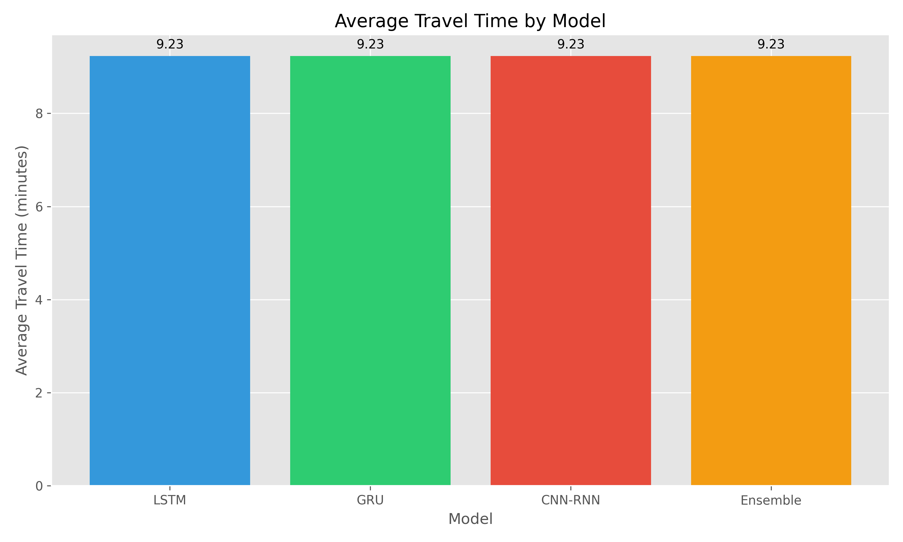
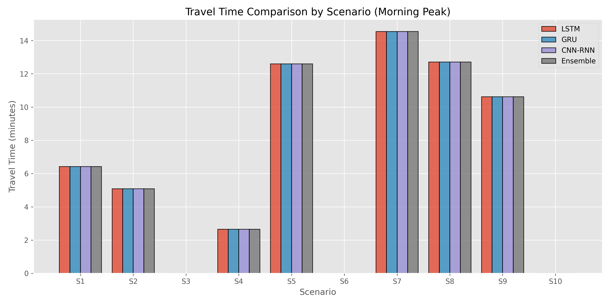
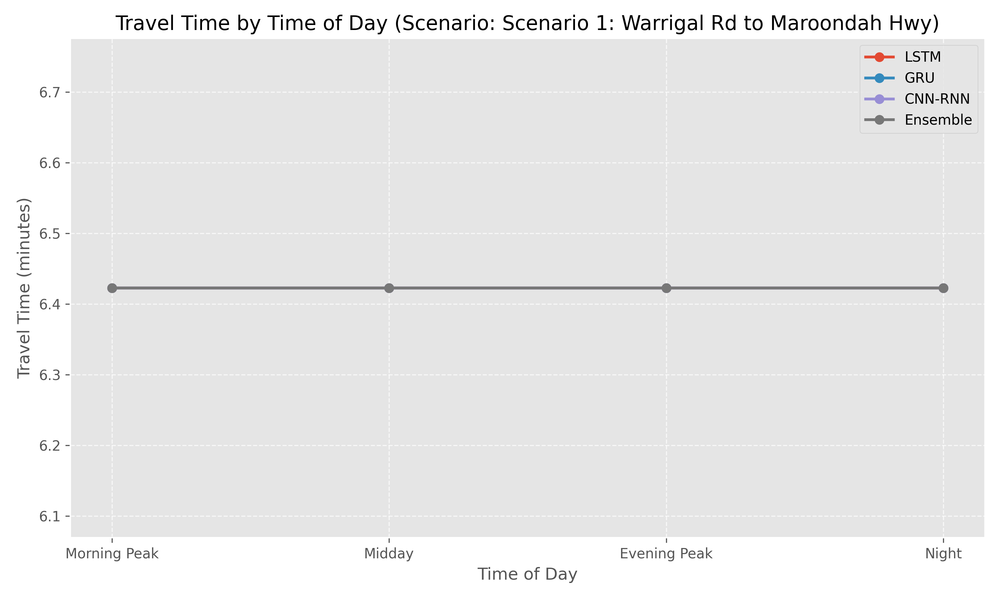

# TBRGS Model Comparison Report

Generated on: 2025-05-25 22:56:16

## Overall Summary

| Model | Average Travel Time | Successful Tests |
|-------|---------------------|------------------|
| LSTM | 9.23 min | 28 |
| GRU | 9.23 min | 28 |
| CNN-RNN | 9.23 min | 28 |
| Ensemble | 9.23 min | 28 |

## Detailed Comparison by Scenario

### Scenario 1: Warrigal Rd to Maroondah Hwy

Origin: 2000, Destination: 2200

| Time Period | Model | Travel Time | Distance | Algorithm |
|-------------|-------|-------------|----------|----------|
| Morning Peak | LSTM | 6.42 min | 3.95 km | astar |
| Morning Peak | GRU | 6.42 min | 3.95 km | astar |
| Morning Peak | CNN-RNN | 6.42 min | 3.95 km | astar |
| Morning Peak | Ensemble | 6.42 min | 3.95 km | astar |
| Midday | LSTM | 6.42 min | 3.95 km | astar |
| Midday | GRU | 6.42 min | 3.95 km | astar |
| Midday | CNN-RNN | 6.42 min | 3.95 km | astar |
| Midday | Ensemble | 6.42 min | 3.95 km | astar |
| Evening Peak | LSTM | 6.42 min | 3.95 km | astar |
| Evening Peak | GRU | 6.42 min | 3.95 km | astar |
| Evening Peak | CNN-RNN | 6.42 min | 3.95 km | astar |
| Evening Peak | Ensemble | 6.42 min | 3.95 km | astar |
| Night | LSTM | 6.42 min | 3.95 km | astar |
| Night | GRU | 6.42 min | 3.95 km | astar |
| Night | CNN-RNN | 6.42 min | 3.95 km | astar |
| Night | Ensemble | 6.42 min | 3.95 km | astar |

### Scenario 2: Maroondah Hwy to Canterbury Rd

Origin: 2200, Destination: 3122

| Time Period | Model | Travel Time | Distance | Algorithm |
|-------------|-------|-------------|----------|----------|
| Morning Peak | LSTM | 5.09 min | 3.06 km | astar |
| Morning Peak | GRU | 5.09 min | 3.06 km | astar |
| Morning Peak | CNN-RNN | 5.09 min | 3.06 km | astar |
| Morning Peak | Ensemble | 5.09 min | 3.06 km | astar |
| Midday | LSTM | 5.09 min | 3.06 km | astar |
| Midday | GRU | 5.09 min | 3.06 km | astar |
| Midday | CNN-RNN | 5.09 min | 3.06 km | astar |
| Midday | Ensemble | 5.09 min | 3.06 km | astar |
| Evening Peak | LSTM | 5.09 min | 3.06 km | astar |
| Evening Peak | GRU | 5.09 min | 3.06 km | astar |
| Evening Peak | CNN-RNN | 5.09 min | 3.06 km | astar |
| Evening Peak | Ensemble | 5.09 min | 3.06 km | astar |
| Night | LSTM | 5.09 min | 3.06 km | astar |
| Night | GRU | 5.09 min | 3.06 km | astar |
| Night | CNN-RNN | 5.09 min | 3.06 km | astar |
| Night | Ensemble | 5.09 min | 3.06 km | astar |

### Scenario 3: High St to Warrigal Rd

Origin: 0970, Destination: 2000

| Time Period | Model | Travel Time | Distance | Algorithm |
|-------------|-------|-------------|----------|----------|
| Morning Peak | LSTM | N/A | N/A | N/A |
| Morning Peak | GRU | N/A | N/A | N/A |
| Morning Peak | CNN-RNN | N/A | N/A | N/A |
| Morning Peak | Ensemble | N/A | N/A | N/A |
| Midday | LSTM | N/A | N/A | N/A |
| Midday | GRU | N/A | N/A | N/A |
| Midday | CNN-RNN | N/A | N/A | N/A |
| Midday | Ensemble | N/A | N/A | N/A |
| Evening Peak | LSTM | N/A | N/A | N/A |
| Evening Peak | GRU | N/A | N/A | N/A |
| Evening Peak | CNN-RNN | N/A | N/A | N/A |
| Evening Peak | Ensemble | N/A | N/A | N/A |
| Night | LSTM | N/A | N/A | N/A |
| Night | GRU | N/A | N/A | N/A |
| Night | CNN-RNN | N/A | N/A | N/A |
| Night | Ensemble | N/A | N/A | N/A |

### Scenario 4: Bulleen Rd to Burke Rd

Origin: 2827, Destination: 2825

| Time Period | Model | Travel Time | Distance | Algorithm |
|-------------|-------|-------------|----------|----------|
| Morning Peak | LSTM | 2.65 min | 1.43 km | astar |
| Morning Peak | GRU | 2.65 min | 1.43 km | astar |
| Morning Peak | CNN-RNN | 2.65 min | 1.43 km | astar |
| Morning Peak | Ensemble | 2.65 min | 1.43 km | astar |
| Midday | LSTM | 2.65 min | 1.43 km | astar |
| Midday | GRU | 2.65 min | 1.43 km | astar |
| Midday | CNN-RNN | 2.65 min | 1.43 km | astar |
| Midday | Ensemble | 2.65 min | 1.43 km | astar |
| Evening Peak | LSTM | 2.65 min | 1.43 km | astar |
| Evening Peak | GRU | 2.65 min | 1.43 km | astar |
| Evening Peak | CNN-RNN | 2.65 min | 1.43 km | astar |
| Evening Peak | Ensemble | 2.65 min | 1.43 km | astar |
| Night | LSTM | 2.65 min | 1.43 km | astar |
| Night | GRU | 2.65 min | 1.43 km | astar |
| Night | CNN-RNN | 2.65 min | 1.43 km | astar |
| Night | Ensemble | 2.65 min | 1.43 km | astar |

### Scenario 5: Princess St to High St

Origin: 2820, Destination: 2846

| Time Period | Model | Travel Time | Distance | Algorithm |
|-------------|-------|-------------|----------|----------|
| Morning Peak | LSTM | 12.59 min | 7.73 km | astar |
| Morning Peak | GRU | 12.59 min | 7.73 km | astar |
| Morning Peak | CNN-RNN | 12.59 min | 7.73 km | astar |
| Morning Peak | Ensemble | 12.59 min | 7.73 km | astar |
| Midday | LSTM | 12.59 min | 7.73 km | astar |
| Midday | GRU | 12.59 min | 7.73 km | astar |
| Midday | CNN-RNN | 12.59 min | 7.73 km | astar |
| Midday | Ensemble | 12.59 min | 7.73 km | astar |
| Evening Peak | LSTM | 12.59 min | 7.73 km | astar |
| Evening Peak | GRU | 12.59 min | 7.73 km | astar |
| Evening Peak | CNN-RNN | 12.59 min | 7.73 km | astar |
| Evening Peak | Ensemble | 12.59 min | 7.73 km | astar |
| Night | LSTM | 12.59 min | 7.73 km | astar |
| Night | GRU | 12.59 min | 7.73 km | astar |
| Night | CNN-RNN | 12.59 min | 7.73 km | astar |
| Night | Ensemble | 12.59 min | 7.73 km | astar |

### Scenario 6: Burke Rd to Warrigal Rd

Origin: 2825, Destination: 0970

| Time Period | Model | Travel Time | Distance | Algorithm |
|-------------|-------|-------------|----------|----------|
| Morning Peak | LSTM | N/A | N/A | N/A |
| Morning Peak | GRU | N/A | N/A | N/A |
| Morning Peak | CNN-RNN | N/A | N/A | N/A |
| Morning Peak | Ensemble | N/A | N/A | N/A |
| Midday | LSTM | N/A | N/A | N/A |
| Midday | GRU | N/A | N/A | N/A |
| Midday | CNN-RNN | N/A | N/A | N/A |
| Midday | Ensemble | N/A | N/A | N/A |
| Evening Peak | LSTM | N/A | N/A | N/A |
| Evening Peak | GRU | N/A | N/A | N/A |
| Evening Peak | CNN-RNN | N/A | N/A | N/A |
| Evening Peak | Ensemble | N/A | N/A | N/A |
| Night | LSTM | N/A | N/A | N/A |
| Night | GRU | N/A | N/A | N/A |
| Night | CNN-RNN | N/A | N/A | N/A |
| Night | Ensemble | N/A | N/A | N/A |

### Scenario 7: High St to Bulleen Rd

Origin: 2846, Destination: 2827

| Time Period | Model | Travel Time | Distance | Algorithm |
|-------------|-------|-------------|----------|----------|
| Morning Peak | LSTM | 14.54 min | 9.02 km | astar |
| Morning Peak | GRU | 14.54 min | 9.02 km | astar |
| Morning Peak | CNN-RNN | 14.54 min | 9.02 km | astar |
| Morning Peak | Ensemble | 14.54 min | 9.02 km | astar |
| Midday | LSTM | 14.54 min | 9.02 km | astar |
| Midday | GRU | 14.54 min | 9.02 km | astar |
| Midday | CNN-RNN | 14.54 min | 9.02 km | astar |
| Midday | Ensemble | 14.54 min | 9.02 km | astar |
| Evening Peak | LSTM | 14.54 min | 9.02 km | astar |
| Evening Peak | GRU | 14.54 min | 9.02 km | astar |
| Evening Peak | CNN-RNN | 14.54 min | 9.02 km | astar |
| Evening Peak | Ensemble | 14.54 min | 9.02 km | astar |
| Night | LSTM | 14.54 min | 9.02 km | astar |
| Night | GRU | 14.54 min | 9.02 km | astar |
| Night | CNN-RNN | 14.54 min | 9.02 km | astar |
| Night | Ensemble | 14.54 min | 9.02 km | astar |

### Scenario 8: Warrigal Rd to Burke Rd

Origin: 2000, Destination: 2825

| Time Period | Model | Travel Time | Distance | Algorithm |
|-------------|-------|-------------|----------|----------|
| Morning Peak | LSTM | 12.71 min | 7.80 km | astar |
| Morning Peak | GRU | 12.71 min | 7.80 km | astar |
| Morning Peak | CNN-RNN | 12.71 min | 7.80 km | astar |
| Morning Peak | Ensemble | 12.71 min | 7.80 km | astar |
| Midday | LSTM | 12.71 min | 7.80 km | astar |
| Midday | GRU | 12.71 min | 7.80 km | astar |
| Midday | CNN-RNN | 12.71 min | 7.80 km | astar |
| Midday | Ensemble | 12.71 min | 7.80 km | astar |
| Evening Peak | LSTM | 12.71 min | 7.80 km | astar |
| Evening Peak | GRU | 12.71 min | 7.80 km | astar |
| Evening Peak | CNN-RNN | 12.71 min | 7.80 km | astar |
| Evening Peak | Ensemble | 12.71 min | 7.80 km | astar |
| Night | LSTM | 12.71 min | 7.80 km | astar |
| Night | GRU | 12.71 min | 7.80 km | astar |
| Night | CNN-RNN | 12.71 min | 7.80 km | astar |
| Night | Ensemble | 12.71 min | 7.80 km | astar |

### Scenario 9: Princess St to Maroondah Hwy

Origin: 2820, Destination: 2200

| Time Period | Model | Travel Time | Distance | Algorithm |
|-------------|-------|-------------|----------|----------|
| Morning Peak | LSTM | 10.61 min | 6.41 km | astar |
| Morning Peak | GRU | 10.61 min | 6.41 km | astar |
| Morning Peak | CNN-RNN | 10.61 min | 6.41 km | astar |
| Morning Peak | Ensemble | 10.61 min | 6.41 km | astar |
| Midday | LSTM | 10.61 min | 6.41 km | astar |
| Midday | GRU | 10.61 min | 6.41 km | astar |
| Midday | CNN-RNN | 10.61 min | 6.41 km | astar |
| Midday | Ensemble | 10.61 min | 6.41 km | astar |
| Evening Peak | LSTM | 10.61 min | 6.41 km | astar |
| Evening Peak | GRU | 10.61 min | 6.41 km | astar |
| Evening Peak | CNN-RNN | 10.61 min | 6.41 km | astar |
| Evening Peak | Ensemble | 10.61 min | 6.41 km | astar |
| Night | LSTM | 10.61 min | 6.41 km | astar |
| Night | GRU | 10.61 min | 6.41 km | astar |
| Night | CNN-RNN | 10.61 min | 6.41 km | astar |
| Night | Ensemble | 10.61 min | 6.41 km | astar |

### Scenario 10: Bulleen Rd to Warrigal Rd

Origin: 2827, Destination: 0970

| Time Period | Model | Travel Time | Distance | Algorithm |
|-------------|-------|-------------|----------|----------|
| Morning Peak | LSTM | N/A | N/A | N/A |
| Morning Peak | GRU | N/A | N/A | N/A |
| Morning Peak | CNN-RNN | N/A | N/A | N/A |
| Morning Peak | Ensemble | N/A | N/A | N/A |
| Midday | LSTM | N/A | N/A | N/A |
| Midday | GRU | N/A | N/A | N/A |
| Midday | CNN-RNN | N/A | N/A | N/A |
| Midday | Ensemble | N/A | N/A | N/A |
| Evening Peak | LSTM | N/A | N/A | N/A |
| Evening Peak | GRU | N/A | N/A | N/A |
| Evening Peak | CNN-RNN | N/A | N/A | N/A |
| Evening Peak | Ensemble | N/A | N/A | N/A |
| Night | LSTM | N/A | N/A | N/A |
| Night | GRU | N/A | N/A | N/A |
| Night | CNN-RNN | N/A | N/A | N/A |
| Night | Ensemble | N/A | N/A | N/A |

## Visualizations

### Average Travel Time by Model

### Travel Time Comparison by Scenario

### Travel Time by Time of Day

